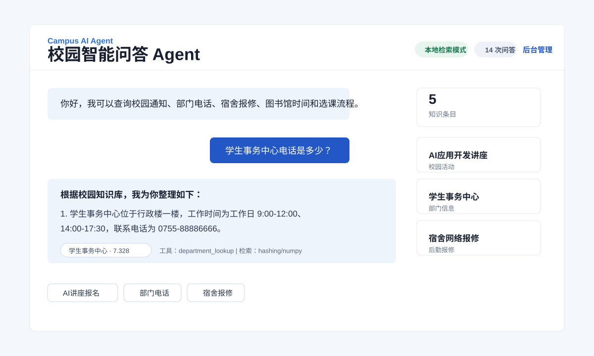
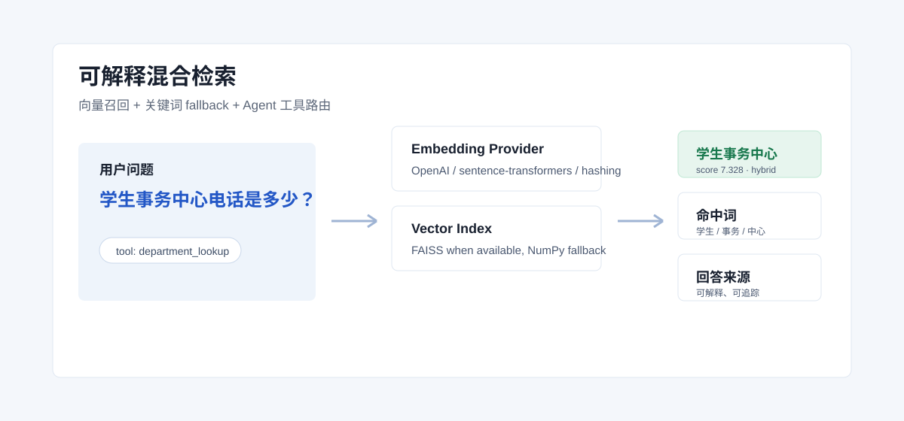
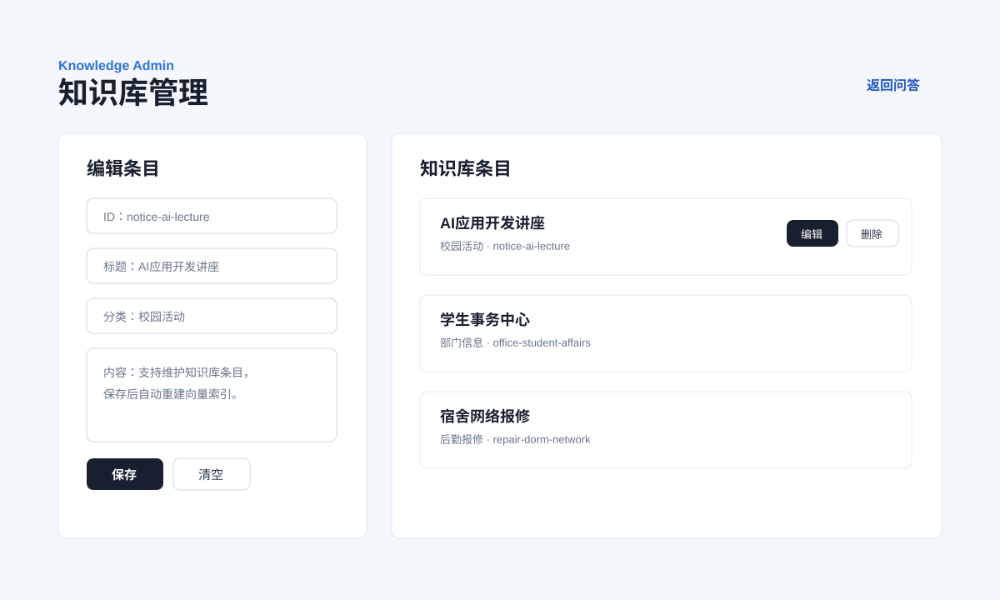

# 校园智能问答 Agent

一个面向校园服务场景的 AI 应用项目，覆盖 **FastAPI、混合向量检索、Agent 工具路由、RESTful API、SQLite 持久化、后台知识库管理、用户反馈闭环和可交互前端演示**。配置 `OPENAI_API_KEY` 后，可自动接入大模型生成更自然的回答。



## 项目定位

校园信息通常分散在通知、教务、后勤、部门页面里，学生经常重复询问“活动怎么报名”“宿舍网络坏了怎么办”“学生事务中心电话是多少”等问题。本项目把这些高频服务沉淀为知识库，并通过 Agent 自动选择查询工具，最终给出可执行回答。

## 项目亮点

- **可运行**：克隆后安装依赖即可启动 FastAPI 服务。
- **可解释**：回答返回来源、得分、命中词、检索模式和工具路由。
- **可维护**：后台支持知识库新增、编辑、删除，并自动重建索引。
- **可扩展**：Embedding、向量索引、大模型接口都做了 fallback 设计。
- **可展示**：包含 API 文档、架构说明、演示脚本、面试讲法和 CI。

## 核心能力

- **混合 RAG 检索**：支持 OpenAI Embedding、sentence-transformers、本地 hashing embedding，并在可用时使用 FAISS，否则回退 NumPy 余弦检索。
- **Agent 工具路由**：根据问题意图选择 `notice_search`、`department_lookup`、`repair_helper`、`academic_helper` 或通用问答。
- **通知分类联动**：可接入 [campus-notice-classifier](https://github.com/vitacool/campus-notice-classifier) 通知分类服务，先识别通知类型，再进行 Agent 工具路由。
- **可解释来源**：接口返回来源、得分和命中词，前端展示回答依据，降低“黑盒回答”感。
- **大模型增强**：支持 OpenAI 兼容接口；无 API Key 时自动降级为本地检索回答。
- **数据闭环**：SQLite 记录问答日志、来源 ID、耗时和用户反馈，支持后续统计与优化。
- **后台管理**：提供 `/admin` 页面，可新增、编辑、删除知识库条目，并自动重建向量索引。
- **工程化展示**：提供 API 文档、架构说明、单元测试和 GitHub Actions CI。

## 界面预览

### 可解释检索



### 后台知识库管理



## 技术栈

- FastAPI / Uvicorn
- SQLite
- NumPy vector retrieval
- HTML / CSS / JavaScript
- RESTful API
- Optional: OpenAI Embedding, sentence-transformers, FAISS

## 项目结构

```text
campus-ai-agent
├── app.py                    # 后端服务、Agent、检索、数据持久化
├── agent.py                  # Agent、混合检索、知识库 CRUD
├── data/knowledge.json       # 校园知识库
├── static/                   # 问答前端和后台管理页面
├── tests/test_agent.py       # 单元测试
├── docs/api.md               # API 文档
├── docs/architecture.md      # 架构说明
├── examples/chat.http        # 接口调用示例
└── resume-description.md     # 简历项目描述
```

## 适合展示的流程

1. 首页提问：`学生事务中心电话是多少？`
2. 查看回答来源、命中词、检索模式和工具路由。
3. 进入 `/admin` 新增一条知识库内容。
4. 回到首页提问新知识，确认后台保存后自动重建索引。

完整演示脚本见 [docs/demo-script.md](docs/demo-script.md)，面试讲法见 [docs/interview-notes.md](docs/interview-notes.md)。

## 快速运行

```powershell
cd campus-ai-agent
pip install -r requirements.txt
python app.py
```

打开：

```text
http://127.0.0.1:8000
```

后台管理页面：

```text
http://127.0.0.1:8000/admin
```

## 接入真实大模型

```powershell
$env:OPENAI_API_KEY="your_api_key"
$env:OPENAI_MODEL="gpt-4o-mini"
```

如使用兼容 OpenAI 接口的其他平台：

```powershell
$env:OPENAI_BASE_URL="https://your-provider.example.com/v1/chat/completions"
```

## 向量检索配置

默认 `EMBEDDING_PROVIDER=auto`：

1. 有 `OPENAI_API_KEY` 时优先使用 OpenAI Embedding。
2. 已安装 `sentence-transformers` 时使用本地语义模型。
3. 都不可用时使用本地 hashing embedding，保证项目仍可运行。

安装更强的本地向量检索能力：

```powershell
pip install -r requirements-optional.txt
```

## 常用接口

```http
POST /api/chat
Content-Type: application/json

{
  "question": "AI讲座怎么报名？"
}
```

```http
POST /api/feedback
Content-Type: application/json

{
  "chat_id": 1,
  "rating": "up"
}
```

更多接口见 [docs/api.md](docs/api.md)。

## 测试

```powershell
python -m unittest discover -s tests
```

## 可继续扩展

- 将 SQLite 替换为 MySQL，适配真实业务数据。
- 增加知识库批量导入功能。
- 接入校园通知分类服务，作为 Agent 前置意图识别和工具路由模块。
- 接入校园统一认证和工单系统。
- 增加鉴权和管理员登录。
- 持久化 embedding 缓存，减少启动时索引重建成本。
